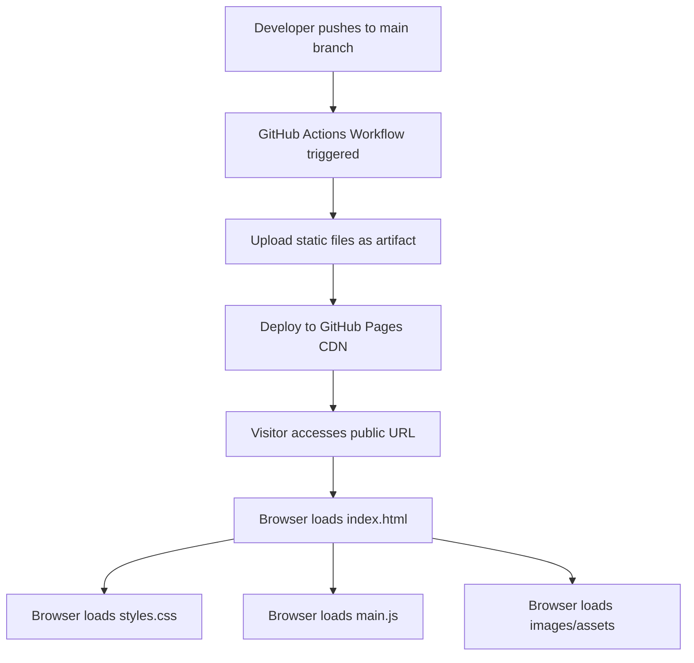
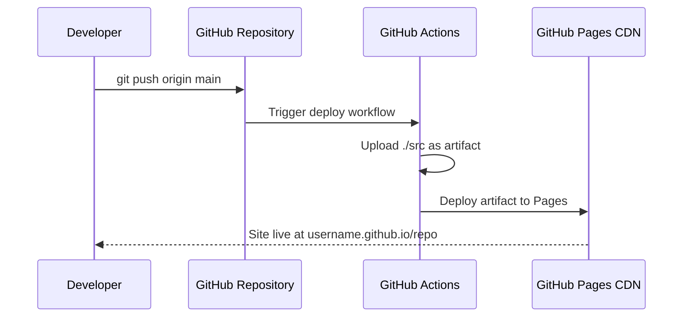

# Design Document: Personal Website

## Overview

This document describes the technical design for a personal/professional static website hosted on GitHub Pages. The site is a single-page application (SPA) built with vanilla HTML, CSS, and JavaScript — no build framework required. All content is served as static files directly from a GitHub repository, with GitHub Actions automating deployment on every push to the main branch.

The design prioritizes:
- **Simplicity**: No build toolchain, no npm dependencies, no framework overhead
- **Performance**: Minimal assets, optimized images, efficient CSS/JS delivery
- **Accessibility**: WCAG 2.1 AA compliance throughout
- **Maintainability**: Clear file structure, content separated from presentation

### Key Design Decisions

**Vanilla HTML/CSS/JS over a framework**: GitHub Pages serves static files natively. A framework (React, Vue, etc.) would add build complexity and bundle size with no meaningful benefit for a personal site of this scope. Vanilla code is also easier for the owner to maintain long-term.

**Single-page layout with anchor navigation**: Rather than multiple HTML files, all sections live in one `index.html` with smooth-scroll anchor links. This eliminates page-load transitions, simplifies deployment, and keeps the navigation model straightforward.

**CSS custom properties for theming**: A single `:root` block defines the color scheme and typography scale. Changing the visual design requires editing one place.

**GitHub Actions for CI/CD**: The official `actions/deploy-pages` workflow provides reliable, zero-configuration deployment. Pushing to `main` triggers the workflow automatically.

---

## Architecture

The site is a static file bundle served by GitHub Pages. There is no server-side logic, no database, and no runtime dependencies.



### Deployment Pipeline



### File Serving Model

GitHub Pages serves files from the repository root (or a configured `/docs` folder, or a `gh-pages` branch). This design uses the repository root with a `src/` directory and a GitHub Actions workflow that deploys the `src/` directory as the Pages artifact. This keeps source files organized without requiring a build step.

---

## Components and Interfaces

### File Structure

```
/
├── .github/
│   └── workflows/
│       └── deploy.yml          # GitHub Actions deployment workflow
├── src/
│   ├── index.html              # Single HTML file — all sections
│   ├── css/
│   │   ├── styles.css          # Main stylesheet (imports partials via @import)
│   │   ├── reset.css           # CSS reset / normalize
│   │   ├── variables.css       # CSS custom properties (colors, typography, spacing)
│   │   ├── layout.css          # Grid and flexbox layout rules
│   │   ├── components.css      # Reusable component styles (cards, buttons, nav)
│   │   └── responsive.css      # Media queries for breakpoints
│   ├── js/
│   │   ├── main.js             # Entry point — initializes all modules
│   │   ├── navigation.js       # Mobile menu toggle, active section tracking
│   │   ├── smooth-scroll.js    # Smooth scroll behavior for anchor links
│   │   └── contact.js          # Contact form validation and submission handling
│   ├── images/
│   │   ├── profile.webp        # Profile/avatar image (optimized WebP)
│   │   ├── projects/           # Project screenshot images (WebP, max 800px wide)
│   │   └── favicon.ico         # Site favicon
│   └── assets/
│       └── resume.pdf          # Optional downloadable resume
├── README.md                   # Repository documentation and content update guide
└── CONTENT_GUIDE.md            # Step-by-step guide for updating site content
```

### HTML Sections (index.html)

The single `index.html` contains these landmark sections, each with a unique `id` for anchor navigation:

| Section ID   | Role Element | Purpose                                      |
|--------------|--------------|----------------------------------------------|
| `#home`      | `<section>`  | Hero/landing — name, title, CTA              |
| `#about`     | `<section>`  | Biographical text, skills summary            |
| `#projects`  | `<section>`  | Project gallery grid                         |
| `#contact`   | `<section>`  | Contact info, social links, optional form    |

Navigation is a `<nav>` element with `<a href="#section-id">` links. The active link is updated via an `IntersectionObserver` in `navigation.js`.

### Navigation Component

```
<header>
  <nav role="navigation" aria-label="Main navigation">
    <a href="#home" class="nav-logo">Name</a>
    <button class="nav-toggle" aria-expanded="false" aria-controls="nav-menu"
            aria-label="Toggle navigation menu">☰</button>
    <ul id="nav-menu" role="list">
      <li><a href="#home" class="nav-link">Home</a></li>
      <li><a href="#about" class="nav-link">About</a></li>
      <li><a href="#projects" class="nav-link">Projects</a></li>
      <li><a href="#contact" class="nav-link">Contact</a></li>
    </ul>
  </nav>
</header>
```

The mobile hamburger button toggles `aria-expanded` and a CSS class that shows/hides the menu. No JavaScript framework needed — a single event listener handles this.

### Project Card Component

Each project is rendered as an `<article>` element inside the projects grid:

```html
<article class="project-card">
  
  <div class="project-card__content">
    <h3 class="project-card__title">Project Name</h3>
    <p class="project-card__description">Brief description of the project.</p>
    <div class="project-card__links">
      <a href="https://demo.example.com" class="btn btn--primary"
         target="_blank" rel="noopener noreferrer">Live Demo</a>
      <a href="https://github.com/user/repo" class="btn btn--secondary"
         target="_blank" rel="noopener noreferrer">Source Code</a>
    </div>
  </div>
</article>
```

### Contact Form Component

The contact form uses the `mailto:` approach or a third-party form service (e.g., Formspree) since GitHub Pages cannot run server-side code:

```html
<form id="contact-form" action="https://formspree.io/f/{form-id}" method="POST"
      novalidate aria-label="Contact form">
  <div class="form-group">
    <label for="name">Name <span aria-hidden="true">*</span></label>
    <input type="text" id="name" name="name" required
           autocomplete="name" aria-required="true">
  </div>
  <div class="form-group">
    <label for="email">Email <span aria-hidden="true">*</span></label>
    <input type="email" id="email" name="email" required
           autocomplete="email" aria-required="true">
  </div>
  <div class="form-group">
    <label for="message">Message <span aria-hidden="true">*</span></label>
    <textarea id="message" name="message" rows="5" required
              aria-required="true"></textarea>
  </div>
  <button type="submit" class="btn btn--primary">Send Message</button>
  <div id="form-status" role="status" aria-live="polite"></div>
</form>
```

The `contact.js` module intercepts form submission, validates fields client-side, submits via `fetch`, and updates the `#form-status` live region with success or error feedback.

### GitHub Actions Workflow

`.github/workflows/deploy.yml`:

```yaml
name: Deploy to GitHub Pages

on:
  push:
    branches: [main]
  workflow_dispatch:

permissions:
  contents: read
  pages: write
  id-token: write

concurrency:
  group: pages
  cancel-in-progress: false

jobs:
  deploy:
    environment:
      name: github-pages
      url: ${{ steps.deployment.outputs.page_url }}
    runs-on: ubuntu-latest
    steps:
      - name: Checkout
        uses: actions/checkout@v4

      - name: Setup Pages
        uses: actions/configure-pages@v5

      - name: Upload artifact
        uses: actions/upload-pages-artifact@v3
        with:
          path: ./src

      - name: Deploy to GitHub Pages
        id: deployment
        uses: actions/deploy-pages@v4
```

---

## Data Models

Since this is a static site with no database, "data models" describe the content structures that the HTML templates represent.

### Project Entry

```
Project {
  id:          string        // kebab-case identifier, used as HTML id
  title:       string        // Display name (max ~60 chars)
  description: string        // 1–3 sentence summary (max ~200 chars)
  image:       string | null // Path to WebP image in src/images/projects/
  imageAlt:    string        // Descriptive alt text for the image
  demoUrl:     string | null // URL to live demo (null if not available)
  repoUrl:     string | null // URL to source code repository (null if private)
  tags:        string[]      // Technology tags (e.g., ["Python", "React"])
}
```

### Social Link Entry

```
SocialLink {
  platform: string  // Display name (e.g., "GitHub", "LinkedIn")
  url:      string  // Full profile URL
  icon:     string  // SVG icon path or Unicode symbol
  ariaLabel: string // Accessible label (e.g., "GitHub profile")
}
```

### Contact Information

```
ContactInfo {
  email:       string        // Public contact email
  socialLinks: SocialLink[]  // Array of social profile links
  formEnabled: boolean       // Whether the contact form is shown
  formAction:  string | null // Formspree endpoint URL (null if form disabled)
}
```

### Site Metadata

```
SiteMetadata {
  ownerName:    string  // Full name for title and headings
  title:        string  // <title> tag content
  description:  string  // Meta description (max 160 chars)
  ogImage:      string  // Path to Open Graph image (1200×630px)
  faviconPath:  string  // Path to favicon.ico
  canonicalUrl: string  // Full canonical URL (e.g., https://user.github.io)
}
```

### Responsive Breakpoints

| Breakpoint | Min Width | Target Devices              |
|------------|-----------|-----------------------------|
| `mobile`   | 320px     | Small phones                |
| `tablet`   | 768px     | Tablets, large phones       |
| `desktop`  | 1024px    | Laptops, desktops           |
| `wide`     | 1440px    | Large monitors              |

CSS media queries use `min-width` (mobile-first approach):

```css
/* Mobile first — base styles apply to all */
/* Tablet and up */
@media (min-width: 768px) { ... }
/* Desktop and up */
@media (min-width: 1024px) { ... }
/* Wide screens */
@media (min-width: 1440px) { ... }
```

---

## Correctness Properties

*A property is a characteristic or behavior that should hold true across all valid executions of a system — essentially, a formal statement about what the system should do. Properties serve as the bridge between human-readable specifications and machine-verifiable correctness guarantees.*

### Assessing PBT Applicability

This feature is primarily a static website with HTML structure, CSS layout, and minimal JavaScript. Most requirements are structural checks (does an element exist?) or infrastructure checks (does the deployment work?). However, several requirements express **universal properties** over collections of elements — "for every image", "for every project card", "for every heading" — that are well-suited to property-based testing using DOM traversal.

The properties below are testable with a DOM testing library (e.g., jsdom + fast-check in Node.js, or Playwright with property generators) that can generate varied HTML documents or inspect the actual rendered DOM.

---

### Property 1: Responsive Layout — No Overflow at Any Viewport Width

*For any* viewport width between 320px and 2560px, the page body and all content sections should not produce horizontal scroll overflow, and all text content should remain within the visible viewport.

**Validates: Requirements 2.1**

---

### Property 2: Navigation Completeness

*For any* section element with an `id` attribute defined in the page, the navigation menu should contain at least one anchor link whose `href` value equals `#<section-id>`.

**Validates: Requirements 3.5**

---

### Property 3: Active Navigation State Correctness

*For any* section that is scrolled into the viewport (determined by IntersectionObserver), the corresponding navigation link should have the `active` CSS class applied, and no other navigation link should have the `active` class simultaneously.

**Validates: Requirements 4.3**

---

### Property 4: Project Card Completeness

*For any* project card rendered in the project gallery, the card should contain: (a) a non-empty title element, (b) a non-empty description element, (c) if an image is present, a non-empty `alt` attribute on the `img` element, and (d) at least one anchor link with a non-empty `href` pointing to either a live demo or a source code repository.

**Validates: Requirements 5.2, 5.3**

---

### Property 5: Contact Form Submission Feedback

*For any* form submission attempt (whether the submission succeeds or fails), the `#form-status` live region should be updated with non-empty feedback text within a reasonable timeout, and the text should differ from the pre-submission empty state.

**Validates: Requirements 6.4**

---

### Property 6: Image Optimization

*For any* image file referenced in the HTML (via `` or CSS `background-image`), the file should be in WebP format and the `` element should include explicit `width` and `height` attributes to prevent layout shift.

**Validates: Requirements 7.2**

---

### Property 7: Lazy Loading for Non-Hero Images

*For any* `` element that does not appear in the initial viewport (i.e., not the hero/profile image), the element should have `loading="lazy"`. *For any* `<script>` element in the document, it should have either the `defer` or `async` attribute.

**Validates: Requirements 7.4**

---

### Property 8: Semantic HTML Structure

*For any* major content section in the page (home, about, projects, contact), the section should be wrapped in a semantic HTML element (`<section>`, `<article>`, `<main>`, `<header>`, `<footer>`, or `<nav>`) rather than a generic `<div>` without a role attribute.

**Validates: Requirements 9.1**

---

### Property 9: Image Alternative Text

*For any* `` element in the document that is not purely decorative, the element should have a non-empty `alt` attribute. Decorative images should have `alt=""` and `role="presentation"`.

**Validates: Requirements 9.2**

---

### Property 10: Interactive Element Accessibility

*For any* interactive element (button, anchor link, form input) in the document: (a) the element should be reachable via keyboard Tab navigation (not have `tabindex="-1"` unless intentionally removed from tab order), and (b) if the element has no visible text content, it should have a non-empty `aria-label` or `aria-labelledby` attribute.

**Validates: Requirements 9.4, 9.5**

---

### Property 11: CSS Custom Property Usage for Colors

*For any* color declaration in the stylesheet (properties: `color`, `background-color`, `border-color`, `fill`, `stroke`), the value should reference a CSS custom property (`var(--color-*)`) rather than a hardcoded hex, rgb, or named color value, ensuring consistent theming.

**Validates: Requirements 11.1**

---

### Property 12: Heading Hierarchy

*For any* sequence of heading elements (`h1`–`h6`) in the document, no heading level should be skipped (e.g., an `h3` should not appear unless an `h2` has appeared before it in the same section). There should be exactly one `h1` element in the document.

**Validates: Requirements 12.3**

---

## Error Handling

### Form Submission Errors

The `contact.js` module handles three error scenarios:

| Scenario | User Feedback | Technical Handling |
|----------|---------------|-------------------|
| Client-side validation failure (empty/invalid fields) | Inline error messages next to each invalid field; `aria-describedby` links field to error | `preventDefault()` on submit; no network request made |
| Network error (fetch fails) | "Unable to send message. Please try again or email directly." in `#form-status` | `catch` block on `fetch` promise |
| Server error (Formspree returns non-2xx) | "Message could not be delivered. Please try again later." in `#form-status` | Check `response.ok` after `fetch` |
| Success | "Thank you! Your message has been sent." in `#form-status`; form fields cleared | `response.ok === true` |

All error messages are injected into the `#form-status` element which has `role="status"` and `aria-live="polite"`, ensuring screen readers announce the feedback.

### Navigation JavaScript Errors

The `navigation.js` module uses `IntersectionObserver`. If the browser does not support it (very old browsers), the active state simply won't update — the navigation remains functional, just without the active indicator. This is a graceful degradation.

### Image Loading Errors

Images use explicit `width` and `height` attributes to reserve space. If an image fails to load, the `alt` text is displayed. No JavaScript error handling is needed for images.

### Deployment Failures

The GitHub Actions workflow uses `concurrency: cancel-in-progress: false` to prevent race conditions. If the deployment step fails, GitHub Actions will report the failure in the repository's Actions tab. The previous deployment remains live — there is no rollback needed since GitHub Pages preserves the last successful deployment.

---

## Testing Strategy

### Overview

This site uses a dual testing approach:
- **Unit/DOM tests**: Verify structural correctness of the HTML, CSS property usage, and JavaScript behavior with specific examples
- **Property-based tests**: Verify universal properties that should hold across all elements of a given type

**Property-based testing library**: [fast-check](https://fast-check.dev/) (JavaScript) with [jsdom](https://github.com/jsdom/jsdom) for DOM testing in Node.js. For visual/interaction tests, [Playwright](https://playwright.dev/) with viewport generation.

### Test Configuration

- Minimum **100 iterations** per property-based test
- Each property test references its design document property via a comment tag:
  - Format: `// Feature: personal-website, Property N: <property_text>`
- Tests run in CI via GitHub Actions on every pull request

### Unit / Example Tests

These cover specific structural requirements and edge cases:

| Test | Requirement | Type |
|------|-------------|------|
| HTML head contains `<title>` and `<meta name="description">` | 12.1 | Example |
| HTML head contains all four Open Graph meta tags | 12.2 | Example |
| HTML head contains `<link rel="icon">` and favicon file exists | 12.4 | Example |
| `#home`, `#about`, `#projects`, `#contact` sections exist in DOM | 3.1–3.4 | Example |
| Nav element is present and not hidden | 4.1 | Example |
| Each nav link `href` matches an existing section `id` | 4.2 | Example |
| Mobile hamburger button exists at 375px viewport | 4.4 | Example |
| Projects section contains ≥ 6 project cards | 5.4 | Example |
| Contact section contains a `mailto:` link | 6.1 | Example |
| Contact section contains ≥ 1 social media link | 6.2 | Example |
| Contact form (if enabled) has name, email, message fields | 6.3 | Example |
| `README.md` and `CONTENT_GUIDE.md` exist and are non-empty | 10.4 | Example |
| `src/` directory structure matches expected layout | 10.1 | Example |

### Property-Based Tests

Each property test maps to a Correctness Property defined above:

| Property | Test Description | Generator |
|----------|-----------------|-----------|
| P1: Responsive Layout | Generate viewport widths in [320, 2560]; check no horizontal overflow | `fc.integer({ min: 320, max: 2560 })` |
| P2: Navigation Completeness | Parse all section ids; verify nav links cover all | DOM traversal over actual HTML |
| P3: Active Nav State | Simulate scroll to each section; verify active class | Playwright with section iteration |
| P4: Project Card Completeness | Generate N project entries (N ∈ [1, 20]); render and verify each card | `fc.array(fc.record({title, description, image, links}))` |
| P5: Form Submission Feedback | Generate valid/invalid form payloads; verify status region updates | `fc.record({name, email, message})` with validity variants |
| P6: Image Optimization | Traverse all img elements; verify WebP format and dimensions | DOM traversal |
| P7: Lazy Loading | Traverse all img/script elements; verify loading/defer attributes | DOM traversal |
| P8: Semantic HTML | Traverse all major sections; verify semantic element usage | DOM traversal |
| P9: Image Alt Text | Generate img elements with varied alt values; verify non-empty alt | `fc.array(fc.record({src, alt}))` |
| P10: Interactive Accessibility | Traverse all interactive elements; verify tab order and aria labels | DOM traversal + Playwright |
| P11: CSS Custom Properties | Parse stylesheet; verify all color values use `var(--color-*)` | CSS AST traversal |
| P12: Heading Hierarchy | Generate heading sequences; verify no skipped levels, one h1 | `fc.array(fc.integer({min: 1, max: 6}))` |

### Smoke Tests

Run once to verify infrastructure and configuration:

- GitHub Actions workflow file exists with correct permissions and steps
- Deployed URL returns HTTP 200
- CSS and JS files are under 50KB each (unminified)
- Browser compatibility audit (no CSS/JS features unsupported in last 2 years)
- Lighthouse CI score: Performance ≥ 90, Accessibility ≥ 95, Best Practices ≥ 90, SEO ≥ 90

### Integration Tests

- Cross-browser rendering: Playwright tests in Chromium, Firefox, and WebKit
- Deployment pipeline: Verify GitHub Actions workflow triggers on push to main
- Form submission: End-to-end test with Formspree test endpoint

### Accessibility Testing

Automated accessibility testing uses [axe-core](https://github.com/dequelabs/axe-core) integrated into Playwright tests. This covers:
- Color contrast ratios (WCAG 2.1 AA: 4.5:1 for normal text, 3:1 for large text)
- ARIA attribute correctness
- Form label associations
- Focus management

Note: Full WCAG 2.1 AA compliance requires manual testing with assistive technologies (screen readers such as NVDA, JAWS, VoiceOver) in addition to automated checks.
